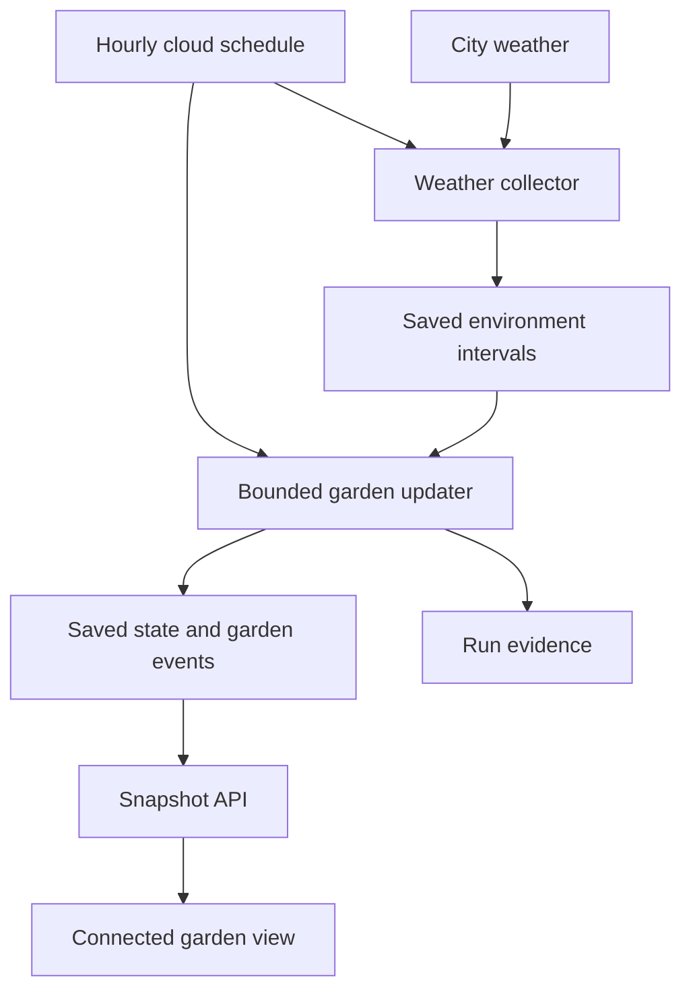

# Stillwild: app brief and background data plan v0.2

Prepared: 4 October 2026, Australia/Darwin.

Status: APPROVED / CANONICAL for the bounded background-garden milestone. Steven Lees approved this brief and authorised action with `/approved / action` on 4 October 2026. Approval establishes the governing requirements; it does not establish implemented operation or a passed 24-hour proof. Implementation evidence is recorded separately.

Existing app: [Stillwild](https://stillwild-garden.subzteveo.chatgpt.site/).

**Purpose.** Give a person a small pixel garden that keeps developing between visits. They return to discover changes without chores, scores, streaks or punishment for absence. The proposed connected garden uses real environmental inputs and records keeper actions while its viewers are away. Animation remains local to a visible screen.

“Any user” is a working product assumption of separate personal gardens. The current build has one shared `origin` record. Separate ownership is a future capability, not an established property of the published app.

**Decision register.** These entries distinguish a user decision from the assistant's proposed design.

| ID | Question | Recorded position | Authority and status |
|---|---|---|---|
| D-01 | Must outcomes exist before the user returns, or may the app compute them on return? | **Scheduled execution.** A server job must advance the garden and persist outcomes independently of visits. | **CONFIRMED by the user, 4 October 2026**, selecting “Scheduled execution (Recommended)” in response to the runtime choice. This decides the required behaviour, not a hosting provider or deployment. |
| D-02 | Which document governs the build? | **This brief governs the background milestone; the fourteen-agent prompt set is parked as a source of possible principles.** | **APPROVED by Steven Lees, 4 October 2026**, through `/approved / action` following the v0.2 handoff. Existing contracts continue to govern legacy gifts, the original garden and the Android companion. |

The fourteen-agent prompt set is **PARKED / NON-GOVERNING in this revision's source inventory**. Its existence and count are reported by the user review. Its original text was not retrieved or inspected for this revision, and the original artifact was not changed. No prompt is silently adopted as a runtime requirement. A principle can enter a later approved brief only through an explicit mapping from source text to a requirement or decision.

The current source has procedural growth and animated keepers. That observation does not decide whether future keepers should use an LLM. A finite-state keeper controller is an implementation candidate for the proof. “The core garden does not require an LLM” is an engineering observation about that candidate, not a recorded user prohibition on LLMs. The role of an LLM remains unselected. Likewise, no scientific calibration of a physical garden has been demonstrated; this is an evidence limit, not a user decision to exclude such a future goal.

**Current build and evidence boundaries.** The inspected source is commit `bcf2d5210282e3683502be5066d745f920ffb191`, previously matched to saved Site version 2. The source remained unchanged during this revision. Current source excerpts and file digests appear below so the reviewer can inspect the claims directly. The reviewer has not independently verified those source files.

| Claim | Evidence available | What it establishes |
|---|---|---|
| `GET /api/garden` returns a garden containing seed, birth time and version 1, plus server time | User review reports an earlier anonymous GET; inspected route agrees | API shape, not separate ownership or scheduled execution |
| Growth gives two plants at one hour, eight at 24 hours, and three keepers at three minutes | User review checked the arithmetic; inspected formula agrees | Existing elapsed-time growth |
| Planting is insert-once for `origin` | Inspected SQL excerpt below | Repeating this operation preserves an existing record; not an independent production write test |
| Up to 45 additional saplings are drawn | Inspected renderer excerpt below | A display cap on additional saplings, not a cap on stored growth or necessarily 45 total visible plants |
| Keeper movement uses an 18-second base phase | Inspected renderer excerpt below | Animation timing, not a saved 18-second work cycle |
| No unattended updater is established | Earlier Site metadata returned `automations: []`; inspected source did not establish a scheduler | No demonstrated background simulation; does not rule out every service outside the inspected project |
| Weather access worked once | Earlier Darwin API probe returned HTTP 200 | Feed accessibility from the inspection environment, not deployed integration or a recurring fetch |

The inspected garden route exports GET and POST. POST accepts an empty JSON object, checks same-origin request headers, and calls the insert-once operation. It exposes no update, reset or delete operation in that handler. This reduces the concern that this route can overwrite the already planted origin. Same-origin checks are not user authentication, and an anonymous read is not private ownership.

Current keepers are **animations**. Future consequences such as planting, storing water or making space need explicit saved state transitions. A return summary must describe recorded events, not infer a story from moving sprites. Existing HTML gifts and the Android companion candidate retain their version 1, local age-based rules; cloud synchronisation and physical-device acceptance are separate work.

**Why scheduled execution was selected.** Either approach can call a function such as `advance(state, elapsedTime, environment, rulesVersion)`. The function alone cannot decide when work occurs.

| Consideration | Scheduled execution | Replay on return |
|---|---|---|
| When the garden changes in storage | During background invocations, before a visit | When a return triggers computation |
| Proof that work happened while all viewers were away | Persisted runs and outcomes can demonstrate it | A return-time computation cannot demonstrate earlier garden execution |
| Normal operating work | Scheduled calls, database writes, retry and overlap handling | Less background garden computation; work and latency occur on return |
| Weather history | Collect and save the inputs used for each tick | Equivalent replay still needs the same historical inputs; this can require background collection |
| Deterministic result | Possible with fixed inputs, rules and random seeds | Equivalent only with the same initial state, ordered intervals, inputs, rules and random seeds |
| Failure recovery | Catch up missed intervals in bounded batches | Replay is the normal update mechanism |

The user selected proof of execution while away. Normal operation must therefore schedule and save garden outcomes. Bounded replay remains a recovery technique for missed jobs, and legacy version 1 scenes may still reconstruct elapsed-time growth. Neither substitutes for the selected proof. Applying today's weather across an unknown historical gap would not establish equivalence between the two approaches.

**First milestone.** Prove unattended operation with one isolated test garden. Keep the original `origin` seed and birth time untouched. Use isolated test storage for mutations and checks. This milestone proposes:

1. One selected Darwin climate and an hourly UTC schedule.
2. A weather collector that saves model-derived inputs with their valid interval, retrieval time and source status.
3. A protected, bounded updater that processes due intervals even with zero connected viewers.
4. A versioned garden state and at least one meaningful saved keeper consequence.
5. A read-only snapshot endpoint, loaded on opening, reconnection and a modest visible-page refresh.
6. Run evidence and a 24-hour absence check.

SSE, WebSockets, streaming reconnection cursors and stream-retention policies are **DEFERRED**. They are absent from this milestone's architecture and acceptance. Durable garden events remain necessary to prove consequences and support an accurate return summary; that does not require a live browser event stream.



The scheduler must have a supported unattended authentication path. A separately deployed Cloudflare Worker with a Cron Trigger is a candidate, not an approved provider choice. Cloudflare documents periodic scheduled handlers and UTC cron timing in its [Cron Trigger documentation](https://developers.cloudflare.com/workers/configuration/cron-triggers/). Direct cron configuration on this managed Site has not been established. An implementation must verify support rather than assume a hosting-manifest field enables it.

The updater uses narrow server authorisation independent of browser sign-in. User-facing garden routes separately enforce ownership. A page view and a snapshot read must not invoke advancement. The first read after absence can then report already saved state without creating the evidence it is supposed to demonstrate.

**Environmental inputs and UTC accounting.** Start with city-level temperature, precipitation, wind and cloud cover, plus sunrise and sunset. Open-Meteo is a candidate feed. Its [forecast documentation](https://open-meteo.com/en/docs) identifies model-derived conditions, hourly precipitation as a preceding-hour sum, and Unix timestamps as GMT+0. These facts describe the source; they do not demonstrate Stillwild's physical realism.

For the proposed updater, request hourly timestamps in UTC, for example with `timezone=GMT&timeformat=unixtime`, then store millisecond UTC values consistently. Local timezone is used for display and daylight presentation. The earlier probe used local Darwin timestamps and must not be reused as if those timestamps were UTC.

Define each garden tick by its UTC interval end:

```text
tick_end_ms = an aligned UTC hour boundary
tick_id = tick_end_ms / 3_600_000
tick interval = the preceding hour ending at tick_end_ms
```

Store the provider's interval start and end as well as `fetched_at_utc`. Fetch time is not the identity of a rainfall interval. Retain units, selected provider values, source/model label and whether the sample is forecast, current, stale or simulated. Future forecast intervals must not be applied early as completed weather.

Uniquely key garden application by `(garden_id, rules_version, tick_id)`. Re-fetching or revising an input for an already applied interval must not add its rainfall again. Archive input revisions, but pin the exact sample used by the committed tick. Do not retrospectively alter a completed outcome merely because a newer forecast appeared. A future corrections policy would need its own design.

If weather is unavailable, continue non-punitive garden development using an explicit stale or simulated input policy. An old rainfall amount must not be repeated as new precipitation for every missing hour. Recovery uses archived intervals or labelled missing-input rules, rather than silently painting current weather across the gap. The precise fallback threshold and keeper transition rules remain implementation proposals to specify before the proof.

**Minimum records and consistency.** The following schema is proposed, not currently implemented.

| Record | Required purpose and fields |
|---|---|
| Garden | Immutable identity, seed and birth time; rules version, selected climate, saved state, revision and last completed UTC tick |
| Environment interval | City, provider, UTC valid start/end, fetched time, values and units, revision, source status |
| Applied tick | Garden, rules version, unique tick ID, pinned input reference, run ID and committed state revision |
| Garden event | Stable event ID, garden and tick, event type, saved consequence and rules version |
| Background run | Trigger origin, scheduled slot, start/end, outcome, committed ticks and errors |

Enforce the unique tick key and conditional state revision. Commit tick completion, state and event consequences atomically, so retries or overlapping jobs cannot create duplicate plants or extra water. Mark a run successful only after its outcomes are committed. Keep attempted execution separate from committed progress; a successful scheduler invocation alone does not prove a garden changed.

Separate personal gardens need authenticated owner mapping and server checks for reads and writes. Knowing a garden ID is not permission. That is a release gate after the isolated proof; it must be completed before extending the promise to any user. Preserve version 1 seed files and existing portable modes through explicit versioning.

**Acceptance and proof limits.** All checks below remain unexecuted for the new scheduled design.

| Check | Required evidence |
|---|---|
| 24-hour absence | Start from a recorded baseline; close every garden view for at least 24 hours. Background runs must commit changed state and at least one meaningful keeper event before the first return request. Independent scheduled logs and commit timestamps must corroborate this; timestamps alone are insufficient. |
| Read-only return | The first return performs a snapshot read only. Its response contains the pre-existing revision and events; it does not create missed activity. |
| Duplicate and overlapping ticks | Repeating the same UTC interval preserves the committed consequence and creates no duplicate event or water increment. |
| Weather outage | Inputs are explicitly marked stale or simulated; precipitation is not double-counted; garden development remains non-punitive. |
| Restart or missed job | Bounded catch-up uses pinned or labelled historical inputs and does not reset the garden. |
| Compatibility | Original seed identity, birth time and version 1 portable behaviour remain usable. |
| Separate-user release gate | Two authenticated owners persist independently; cross-garden reads and writes are rejected. |

Do not present background execution as delivered until the absence proof passes. The present decision confirms a requirement, not an operational result.

**User-supplied SSE examples: reference only.** The conversation contains three examples: constructing `new EventSource("sse-demo.php")`; adding a named `ping` listener that parses `event.data.time` and appends a list item; and a PHP response loop that emits timestamp pings once per second, occasional unnamed text messages, flushes output and breaks after client disconnection.

These examples illustrate connected server-to-browser delivery. They do not instruct this project to use PHP, the `America/New_York` timezone, one-second simulation ticks, a list-based interface or a continuously open connection. Their status in this brief is **NON-NORMATIVE TRANSPORT REFERENCE**. The PHP loop stops after a client disconnects, so it is not the selected unattended scheduler. No `sse-demo.php` endpoint was created. If live push is later approved, it must deliver saved outcomes without becoming responsible for garden execution.

**Source excerpts for review.** These are narrow extracts of the inspected commit, supplied to expose the source-level claims. They are not independent reviewer verification or a replacement for the repository. The paths below are relative to the cited commit.

`db/garden.ts`:

```typescript
return db().prepare("SELECT seed, born_at AS bornAt, version FROM gardens WHERE id = ?").bind("origin").first<Garden>();

await db().prepare("INSERT INTO gardens (id, seed, born_at, version) VALUES (?, ?, ?, 1) ON CONFLICT(id) DO NOTHING").bind("origin", bytes[0], Date.now()).run();
```

SHA-256: `1af5c887140b256da8e7ea345a645d4d54476d7994489d0ff3665355b0800dd0`.

`lib/garden.ts`:

```typescript
const age = garden ? Math.max(0, now - garden.bornAt) : 0;
const plants = garden ? 1 + Math.floor(Math.sqrt(age / 3600000) * 1.5) : 0;
const agents = garden ? Math.min(3, 1 + Math.floor(age / 90000)) : 0;
```

SHA-256: `cfa6f32dc9b043743a89d6c704993a60e0229fcabeb6467cb4d03a8829172c4e`.

`lib/render-garden.ts`:

```typescript
const phase = reduced ? 0 : loopPhase ?? ((now % 18000) / 18000 * Math.PI * 2);
const max = Math.min(growth.plants - 1, 45);
const plantId = Math.max(0, growth.plants - 46) + i;
```

The latter two lines are in the additional-sapling rendering branch, with `plantId` inside its loop. SHA-256: `9b291dc80a347dfdac99bb9126958c3578302bf07f8a9001d2172e700fcba272`.

`app/api/garden/route.ts` exports GET and POST. Its SHA-256 is `2c172d3d7bc95431524bbbea02f774a9ebe2e257a712c4cd9995666cd19bdfa2`. The empty-object and same-origin checks described above belong to that inspected handler; no production POST was executed for this revision.

**Earlier feed probe, retained as evidence.** At `2026-10-04T04:01:48.661348+00:00`, the Darwin request returned HTTP 200, 48 hourly rows and sunrise/sunset fields. Selected modelled current values at Darwin 13:30 were 28.6 °C, precipitation 0.1 mm, cloud cover 16% and wind 14.7 km/h. This was one request, not a scheduler test.

Exact earlier request:

```text
https://api.open-meteo.com/v1/forecast?latitude=-12.4634&longitude=130.8456&current=temperature_2m,relative_humidity_2m,is_day,precipitation,weather_code,cloud_cover,wind_speed_10m&hourly=temperature_2m,precipitation,cloud_cover,wind_speed_10m&daily=sunrise,sunset&timezone=Australia%2FDarwin&forecast_days=2
```

**Changes from v0.1 and the explainer.** This revision records the confirmed scheduling choice, weighs replay fairly, records the approved authority hierarchy and the parked prompt set, and removes unapproved conclusions about the future role of LLMs or scientific modelling. It restores snapshot-and-refresh scope, specifies UTC interval accounting, documents the SSE examples' reference status and provides source excerpts. Approval closes authority confirmation. The new implementation's acceptance evidence remains outstanding; no overall PASS is claimed.
