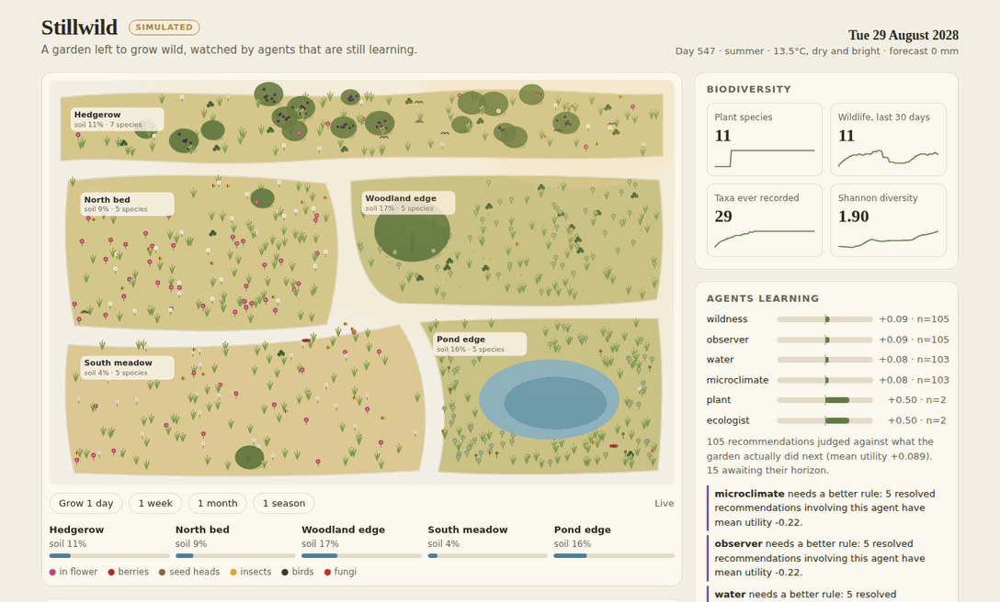

# Still Wild Garden

**A forever-growing garden that evolves over time with the help of agents.**

Stillwild is a persistent agentic ecological system. It is designed to keep observing, reasoning and accumulating evidence even when nobody has the app open.

The first working spine implements:

- durable garden events
- persistent garden memory
- specialised garden agents
- a wildness/intervention gate
- a council that resolves recommendations
- bounded experiments
- delayed outcome recording
- evidence-based agent evolution candidates
- a long-running background worker
- reconnectable Server-Sent Events (SSE)
- explicit action authority boundaries

## Run

```bash
docker compose up --build
```

Then open:

```text
http://localhost:8000/docs
```

Health:

```bash
curl http://localhost:8000/health
```

## Send a real garden observation

```bash
curl -X POST http://localhost:8000/events \
  -H "content-type: application/json" \
  -d '{
    "type": "sensor.soil_moisture",
    "zone_id": "north-bed",
    "source": "soil-sensor-01",
    "payload": {
      "percent": 17.2,
      "forecast_rain_mm_24h": 0
    }
  }'
```

Stillwild stores the observation, routes it to relevant agents, applies the wildness gate, records a council recommendation and updates evidence-linked memory.

## Stream garden events

```js
const source = new EventSource("http://localhost:8000/stream");

source.addEventListener("garden_event", (event) => {
  const gardenEvent = JSON.parse(event.data);
  console.log("garden changed", gardenEvent);
});
```

The stream uses durable event sequence IDs. Reconnection can resume from `Last-Event-ID` without treating the browser as the source of truth.

## Background life

The `worker` container wakes on a configurable interval and emits a `system.tick`. It runs independently of any connected user.

```text
STILLWILD_TICK_SECONDS=300
```

If your host cannot run a permanent worker, schedule:

```text
POST /tasks/tick
```

from the host's cron/scheduler.

## The Wild: a garden that grows on its own

Real outcomes take seasons to arrive, so an agent that waits for a real garden learns slowly.
The Wild is a seeded, persistent ecosystem the agents can live in while they learn:

- **Seasons and weather.** Temperature follows the year, rain falls in wet and dry spells, and
  the 24-hour forecast is usually but not always right.
- **Soil water.** Each zone gains moisture from rain and the water table, and loses it to
  drainage and to evapotranspiration, which slows as the soil dries.
- **Plants.** 14 native species germinate from the seed bank, compete for light and space,
  flower, set seed, spread on the wind or with birds, wilt in drought and die back. New species
  drift in from outside, and shrubs and trees slowly shade the ground beneath them.
- **Wildlife and fungi.** Bees follow the nectar, goldfinches the seed heads, blackbirds the
  berries, jays the acorns, and frogs and dragonflies the pond. Fungi fruit after rain where
  their hosts grow.

The Wild belongs to this experimental backend only. It is not connected to the pixel garden in
`web/`, uses no real weather feed, and does not count as evidence for the pixel-garden milestone.

Its readings flow through the normal engine, so agents, the council, memory and the event
stream all see the garden change. After a fixed horizon, the Wild judges each irrigation or
inspection recommendation against what actually happened next, records the outcome, and lets
poor advice raise agent evolution candidates. Advice is judged on what the garden did without
it, because the recommended action is never executed.

Run a dedicated simulated garden (the `-p` project name gives it its own data volume):

```bash
STILLWILD_WILD_SIM=true docker compose -p stillwild-wild up --build
```

Then open the live garden at:

```text
http://localhost:8000/garden
```



The worker grows the garden by `STILLWILD_WILD_DAYS_PER_TICK` simulated days on each tick.
To fast-forward a season, use:

```bash
curl -X POST "http://localhost:8000/wild/advance?days=91"
```

The simulation is deterministic for a given `STILLWILD_WILD_SEED`.

A simulated garden is never a real one. Every event it emits carries `"simulated": true` and
the source `wild-sim`. The Wild refuses to run against a database that already holds real
observations, and it is off unless `STILLWILD_WILD_SIM=true`.

## Authority

Automatic physical action is **off by default**.

```text
STILLWILD_AUTOMATION_AUTHORITY=false
```

Agents may propose watering, inspection or another intervention. Stillwild does not claim an action happened until an authorised actuator integration returns telemetry.

## Event types

The initial agents understand these event families:

- `sensor.soil_moisture`
- `sensor.temperature`
- `sensor.humidity`
- `sensor.light`
- `weather.forecast`
- `weather.rain`
- `plant.observation`
- `wildlife.observation`
- `fungi.observation`
- `system.tick`

Unknown event types are still durably stored and observed. New agents can be added without changing the event ledger.

## API surface

- `GET /health`
- `POST /events`
- `GET /events`
- `GET /stream`
- `GET /state`
- `POST /experiments`
- `POST /outcomes`
- `POST /tasks/tick`
- `GET /wild` (simulated garden snapshot)
- `POST /wild/advance?days=N` (requires `STILLWILD_WILD_SIM=true`)
- `GET /garden` (live garden page)

## Principle

Stillwild should not optimise the garden into submission.

Its default loop is:

```text
observe
  -> model
  -> interpret
  -> experiment when uncertain
  -> intervene only when justified
  -> measure
  -> remember
  -> evaluate the agents themselves
  -> adapt through tested changes
```

See [`docs/ARCHITECTURE.md`](docs/ARCHITECTURE.md) for the system boundary and next layers.
