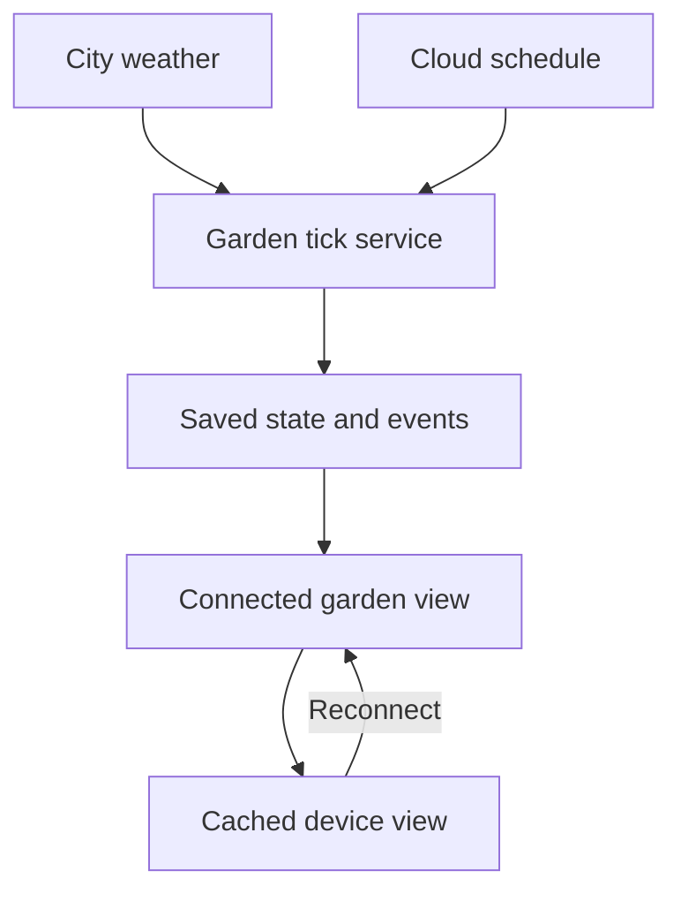

# Stillwild: app brief and background data plan

Status: DRAFT DESIGN. Existing source inspected; one external weather request executed. No application changes, new accounts, schedules or deployments were made for this brief.

Prepared: 4 October 2026, Australia/Darwin.

Existing app: https://stillwild-garden.subzteveo.chatgpt.site/

**Goal.** Give each person a small digital garden that keeps developing between visits. Real weather, daylight and the garden's own history influence what happens. Returning means discovering change, without catching up on chores.

**The app brief.** Stillwild is a living pixel garden for people who enjoy having a small world alongside their day. Plant one seed and let three little keepers make a home around it. They sow, carry water and create room for new growth. Weather moves through the island. Light changes. Seasons unfold. You can watch quietly, turn on ambient sound, keep the garden in a small viewing bubble or give someone a seed of their own.

The experience should feel alive without demanding attention. No tasks. No score. No streaks. No punishment for being away. The garden carries on because its state lives in the cloud and a background service advances it. Its animations play on the device while it is visible.

**Working assumption.** “Any user” means each person has their own garden. A shared public world is a possible later mode. The current site has one shared origin record, so separate personal gardens are a new product capability, not an existing one.

**What the current build establishes.** The inspected checkout matches saved Site version 2, commit `bcf2d5210282e3683502be5066d745f920ffb191`. Its deployment status was read as `succeeded` for the current app URL. The source checkout remained unchanged.

| Finding | Evidence | Meaning |
|---|---|---|
| Cloud persistence exists | D1 configuration, `db/schema.ts`, `db/garden.ts` | The saved beginning survives browser sessions. |
| There is one garden record | Queries use `id = 'origin'` | Every request uses the same garden; no per-user ownership is implemented. |
| Growth follows elapsed time | `lib/garden.ts` derives plants, age and seasons from seed and birth time | The scene catches up when rendered. No background simulation job is required for this existing behaviour. |
| Keepers are visual simulations | Growth and renderer code; product contract | They are not continuously running LLM services. |
| Weather is presentation copy | `app/page.tsx` displays “A little after dusk” | It does not currently describe a live weather feed. |
| No linked schedules exist | Current Site metadata returned `automations: []` | No linked Sites updater is established. No scheduler was found in the inspected source. |
| Hosting is currently public | Current Site metadata | Source documents still describe owner-private hosting. Personal ownership must be implemented before treating the public app as separate private gardens. |
| Portable gifts run locally | `lib/gift.ts`, `lib/seed-runtime.ts` | Existing HTML gifts retain their own seed and age-based growth; their network access is blocked. |
| Android is an offline companion candidate | `android/README.md` and current checkpoint | It imports the same beginning, has no internet permission and does not sync live cloud changes. Device acceptance remains unexecuted. |

This is a source and configuration inspection, not a new production persistence or device test. The original garden was not planted, reset or modified.

**The strongest product ideas.** Begin with changes that make the world feel more alive while keeping the quiet interface.

1. **Weather passes through.** Rain adds ripples and fills a small pond. Wind changes leaf movement. Cloud cover softens the light. A person can select a city or keep a fictional climate.
2. **Keepers leave consequences.** Pip plants a seed, Dew stores water and Moss opens a new patch. Their completed actions change saved state, rather than only their animation.
3. **A small memory of absence.** On return, offer one optional sentence drawn from recorded events: “Rain filled the pond. Pip planted two seeds.” No invented account of unseen activity.
4. **Gifts preserve a beginning.** Keep the existing self-contained offline seed format. A future connected gift can create a separate hosted garden with lineage and explicit adoption. It must be a distinct mode, because the current file has no cloud identity.
5. **Seasons make room.** Let the garden renew without losing its identity. Older growth becomes part of its history instead of filling the screen indefinitely.

The first release should concentrate on the first three ideas. Gifting and native synchronisation can follow the successful cloud proof.

**What “still working while offline” means.** There are three separate behaviours.

| Situation | Required behaviour |
|---|---|
| The user closes the app or turns their device off | The cloud service fetches inputs, advances the garden and saves changes on its schedule. |
| The device has no connection | A cached or imported garden can render locally. Its display cannot receive new cloud data until reconnection. Full offline website reopening would require a cache/service-worker implementation; it is not established by the current build. |
| The user reconnects | The app loads the latest saved state and the recorded changes since their last visit. Local animation resumes from that state. |

Browsers throttle background timers and commonly stop rendering hidden pages. A service worker is event-driven and is not a permanent always-running garden process. The unattended work belongs on the server. See [MDN: page visibility](https://developer.mozilla.org/en-US/docs/Web/API/Page_Visibility_API) and [MDN: offline and background operation](https://developer.mozilla.org/en-US/docs/Web/Progressive_web_apps/Guides/Offline_and_background_operation).

**Actual data to start with.** Use a city-level weather source and the garden's own event history. Continuous video, sensor hardware and a permanently connected phone are unnecessary for this first version.

| Input | Source | Proposed cadence | Garden effect |
|---|---|---|---|
| Rain, temperature, wind and cloud cover | Open-Meteo API | Hourly cloud fetch, shared by gardens using the same city | Rain, water, leaf movement, colour and environmental conditions |
| Sunrise, sunset and daylight | City coordinates, timezone and provider values | Refresh daily; derive light locally between known times | Dawn, dusk, night palette and keeper routines |
| Garden events | The app's simulation service | Evaluate each hourly tick; save meaningful changes | Planting, stored water, habitat changes and seasonal transitions |
| Ownership and preferences | Authenticated user actions | When changed | Which garden is loaded and which climate it uses |

Open-Meteo exposes model-derived conditions. A successful response is not a direct measurement at somebody's home. Record that distinction. Its documentation also explains that 15-minute fields outside the covered regions can be interpolated from hourly data; this brief therefore starts with hourly weather. See [forecast API documentation](https://open-meteo.com/en/docs).

Use a manually selected city or an optional city choice based on the user's location. Store the selected city and timezone. Precise home coordinates and continuous location tracking are not needed. A fictional-climate mode should remain clearly simulated.

The free hosted API is for non-commercial use and requires attribution. Commercial operation needs an eligible service plan or another permitted deployment. See [Open-Meteo terms](https://open-meteo.com/en/terms) and [pricing](https://open-meteo.com/en/pricing), checked 4 October 2026.

**Executed feed probe.** An HTTP request to the Darwin forecast endpoint returned status 200 at `2026-10-04T04:01:48.661348+00:00`, equivalent to 13:31:48 in Darwin. It supplied 48 hourly entries, modelled current conditions, and sunrise/sunset values.

Exact request:

```text
https://api.open-meteo.com/v1/forecast?latitude=-12.4634&longitude=130.8456&current=temperature_2m,relative_humidity_2m,is_day,precipitation,weather_code,cloud_cover,wind_speed_10m&hourly=temperature_2m,precipitation,cloud_cover,wind_speed_10m&daily=sunrise,sunset&timezone=Australia%2FDarwin&forecast_days=2
```

Selected raw output:

```json
{
  "status": 200,
  "retrieved_at": "2026-10-04T04:01:48.661348+00:00",
  "timezone": "Australia/Darwin",
  "current": {
    "time": "2026-10-04T13:30",
    "interval": 900,
    "temperature_2m": 28.6,
    "relative_humidity_2m": 63,
    "is_day": 1,
    "precipitation": 0.1,
    "weather_code": 51,
    "cloud_cover": 16,
    "wind_speed_10m": 14.7
  },
  "daily": {
    "time": ["2026-10-04", "2026-10-05"],
    "sunrise": ["2026-10-04T06:28", "2026-10-05T06:27"],
    "sunset": ["2026-10-04T18:42", "2026-10-05T18:42"]
  },
  "hourly_count": 48
}
```

This establishes feed accessibility from the inspection environment. It does not establish a deployed app connection, a recurring fetch or a saved garden update.

**Recommended runtime.** Keep the current Sites app, renderer and D1 database. Add an authenticated server endpoint that performs one bounded simulation tick. An hourly cloud scheduler invokes it independently of visitors. The keepers receive normalised environment values; the separate ingestion service makes external requests. The keepers retain their isolation from tools and outside actions.



For a small proof, a Sites-linked automation can invoke the updater once supported unattended authentication is verified. An automation prompt must call the existing deterministic updater, rather than ask a model to invent each garden's next state.

For a multi-user product, prefer a deterministic scheduler. A small separately deployed Cloudflare Worker with a Cron Trigger can call the Site's protected tick endpoint. Configure a server-only signing credential in both services; verify the signature, timestamp and allowed action at the Site endpoint. Keep credentials out of the browser and prompts. [Cloudflare documents Cron Triggers](https://developers.cloudflare.com/workers/configuration/cron-triggers/) for periodic API collection. This capability is documented for Cloudflare Workers; direct Cron binding support on this managed Site has not been established. Do not assume adding a cron field to its hosting manifest will work.

The public Site's platform service credential alone does not establish permission to change personal gardens. The updater needs its own narrow server authorization. User routes separately enforce each garden's owner. Browser sign-in must not be required for a scheduled service to run.

Start with hourly execution. At ordinary one-location request weight, that is 24 weather requests per city per day, shared across that city's gardens. This is an engineering estimate, not a provider invoice. Process all retained gardens that are due, including those with no connected viewers. Batch work as garden count grows. Add a durable queue and retries if the job outgrows one bounded invocation.

**Streaming to the screen.** Weather ingestion and browser delivery are different parts of the system. Open-Meteo is a fetched HTTP feed in this design. Start the connected view with a state request on opening, reconnection and a modest visible-page refresh. A later server-sent event endpoint can push saved changes while the view is connected. SSE supports one-way delivery and event IDs, but durable state and explicit replay must still handle missed events. See [MDN: using server-sent events](https://developer.mozilla.org/en-US/docs/Web/API/Server-sent_events/Using_server-sent_events).

No connection remains open to a powered-off device. No rendered frames need to be saved while nobody is watching. The backend stores consequences; the device draws movement.

**State required for separate gardens.** Add new schema migrations and preserve the original seed and birth time. Existing version 1 portable files must continue to work.

| Record | Minimum fields |
|---|---|
| Garden | ID, authenticated owner ID, immutable seed, birth time, rules version, selected climate, state revision, last processed tick |
| Environment sample | City key, provider, valid time, fetched time, selected values, source status and model-derived label |
| Garden event | Garden ID, deterministic event ID, tick slot, event time, type, consequences and rules version |
| Background run | Run ID, scheduled slot, start/end, success/failure, processed count and last error |
| Visit | Owner and garden ID, last acknowledged event position |

Use the authenticated server identity when resolving a person's garden. An anonymous visitor can view a deliberate demo, but must not inherit another person's private record. Knowing a garden ID is not permission to read or change it. Preserve `origin` during the proof; any later owner mapping needs an explicit migration plan.

**Recovery behaviour.** Repeating a tick must not create extra plants or events. Use unique tick/event keys and a conditional state revision so overlapping runs cannot double-apply changes. Save state, event consequences and the processed position consistently.

If a weather fetch fails, keep the last good sample with its timestamp and source status. After a defined freshness threshold, use a clearly simulated fallback. Continue non-punitive garden growth. Do not describe stale or invented inputs as live weather. Catch up missed ticks in bounded batches, using stored samples for their relevant times; do not apply today's weather retrospectively across an unknown gap.

Version weather-driven rules separately from the original age-only rules. A growth change must not silently rewrite the old garden's past. Existing offline gifts and the Android candidate stay on their existing rules until an explicitly versioned adapter is implemented. True Android cloud synchronisation would require a separately designed network and identity path; it is not supplied by the current import feature.

**The smallest next build.** Create one separate test garden with a selected Darwin climate, one protected updater and one hourly background trigger. Save a real environment sample and a meaningful keeper event while every garden view is closed. Keep the original owner garden untouched. This is a proof of unattended operation, not a public multi-user release.

| Acceptance check | Required evidence |
|---|---|
| All clients closed for 24 hours | Scheduled run records and changed saved state with timestamps preceding the first return request |
| Duplicate tick | Same state revision/consequences; no duplicate events |
| Weather outage | Preserved last good input, marked freshness and continued safe simulation |
| Missed run/restart | Bounded catch-up with no reset or duplicate growth |
| Two different owners | Server denies cross-garden reads and writes; both gardens persist independently |
| Return from disconnection | Latest cloud state and recorded missed changes load; no fabricated recap |
| Legacy compatibility | Original seed identity and version 1 offline files remain usable |

Before a release for any user, complete the ownership model, migrate the original garden safely and execute the two-owner isolation check. Then extend the proven updater across all due gardens. Native syncing and richer live transport follow the same saved state, rather than becoming separate simulations with conflicting histories.

The product promise should be used only after that proof: **Plant once. Come back whenever. Your garden keeps its own time.**
